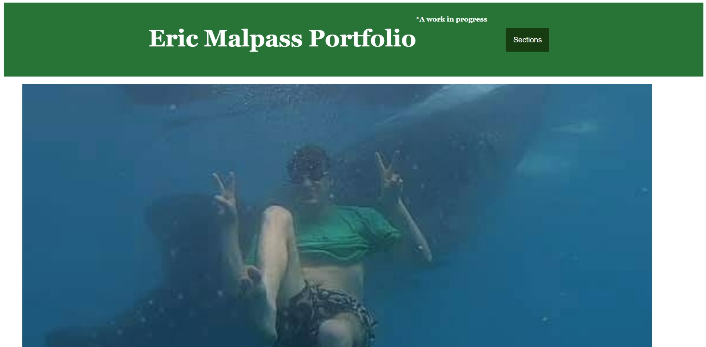
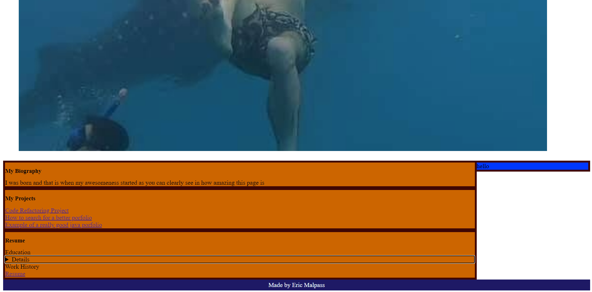

# Portfolio
Homework assignment number 6

In this Assignment I and made a basic portfolio and incorporate most of the elements that we have covered in the course so far.

Link to active site:
https://ericmalpass.github.io/Portfolio/

Link to repo:
https://github.com/EricMalpass/Portfolio/

I recieve alot of support from my study group, tutur, askbcs tuturs, and various websites: 

Study Group:

-Li Hua Anderson

-Sam Oberg

-Kelly Dean Mahaffey

Tutur

-Quint Turner

Main websites:

https://www.w3schools.com/

https://docs.github.com/
