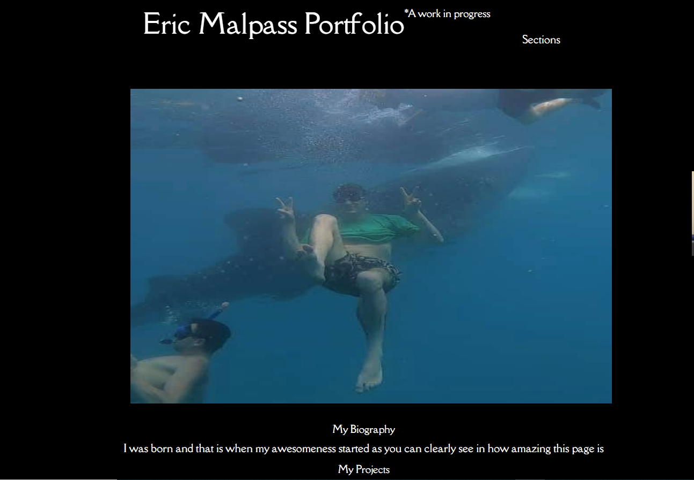

# Portfolio
Homework assignment number 2 

In this Assignment I and made a basic portfolio and incorporate most of the elements that we have covered in the course so far. I attempted to do a few things that didn't work out and I was unable to find a solution for, I left the incorrect code in the source taken out with comments. I was unable to really make it look pretty so I ran with a very basic comical color and format as to make the different elements clearly visable.

Link to active site:
https://ericmalpass.github.io/Portfolio/

Link to repo:
https://github.com/EricMalpass/Portfolio/

I recieve alot of support from my study group, tutur, askbcs tuturs, and various websites: 

Study Group:

-Li Hua Anderson

-Sam Oberg

-Kelly Dean Mahaffey

Tutur

-Quint Turner

Main websites:

https://www.w3schools.com/

https://docs.github.com/
